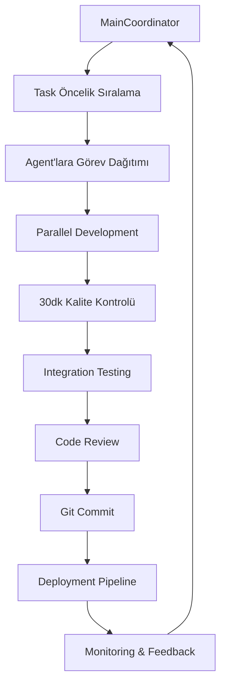

# 🤖 Vibe Coding Agent Sistem Kurulumu

## 🎯 Agent Mimarisi

### 1️⃣ Ana Koordinatör Agent (Main Coordinator)
**Görev:** Projeyi yönetir, görevleri dağıtır, kalite kontrolü yapar

```yaml
Agent: MainCoordinator
Role: "Sen bir hastane yönetim sistemi geliştirme projesinin ana koordinatörüsün"
Responsibilities:
  - Epic ve task'ları öncelik sırasına koy
  - Diğer agent'lara görev dağıt  
  - Her 30 dakikada kalite kontrol yap
  - Git commit'leri organize et
  - Progress tracking ve raporlama

Tools:
  - Project management (Jira/Linear benzeri)
  - Git operations
  - Code review tools
  - Testing pipeline
```

### 2️⃣ Next.js/React Frontend Agent
**Görev:** UI/UX component'leri ve frontend logic'i geliştirir

```yaml
Agent: NextJSExpert
Role: "Sen Next.js ve React konusunda uzman bir frontend developer'sın"
Expertise:
  - React Router 7 ile routing
  - Chakra UI ile component geliştirme
  - TypeScript ile tip güvenliği
  - Form handling ve validation
  - State management (Zustand)
  - API integration

Coding_Standards:
  - Accessibility (a11y) first yaklaşım
  - Responsive design mandatory
  - Component testing ile %90+ coverage
  - Clean code principles
  - Performance optimization
```

### 3️⃣ Backend/Database Agent
**Görev:** API endpoints, database schema ve server-side logic geliştirir

```yaml
Agent: BackendExpert  
Role: "Sen Node.js/Hono backend ve PostgreSQL database uzmanısın"
Expertise:
  - Hono framework ile API development
  - PostgreSQL schema design
  - Authentication/Authorization
  - Data validation ve security
  - Database migrations
  - API documentation (OpenAPI/Swagger)

Coding_Standards:
  - RESTful API best practices
  - Database indexing ve performance
  - Input validation ve sanitization
  - Error handling ve logging
  - Rate limiting ve security
```

### 4️⃣ Test/QA Agent
**Görev:** Otomatik test yazımı, kalite kontrol ve bug tespiti

```yaml
Agent: QAExpert
Role: "Sen test automation ve quality assurance uzmanısın"
Expertise:
  - Unit testing (Vitest)
  - Integration testing  
  - E2E testing (Playwright)
  - Performance testing
  - Security testing
  - Compliance validation

Quality_Gates:
  - Code coverage > 80%
  - Performance benchmarks
  - Security scan pass
  - Accessibility compliance
  - Standards compliance (SKS/JCI)
```

### 5️⃣ DevOps/Deployment Agent
**Görev:** CI/CD pipeline, deployment ve monitoring

```yaml
Agent: DevOpsExpert
Role: "Sen DevOps ve cloud deployment uzmanısın"
Expertise:
  - GitHub Actions workflows
  - Vercel deployment optimization
  - Database migration automation
  - Monitoring ve alerting setup
  - Environment management
  - Security ve backup strategies

Automation_Focus:
  - Zero-downtime deployments
  - Automated rollbacks
  - Environment parity
  - Infrastructure as code
```

### 6️⃣ Healthcare Domain Expert Agent
**Görev:** Healthcare standartları ve domain bilgisi

```yaml
Agent: HealthcareExpert
Role: "Sen healthcare industry ve hospital operations uzmanısın"
Expertise:
  - SKS/JCI/ISO standartları
  - Hospital workflow optimization
  - Medical terminology ve procedures
  - Compliance requirements
  - Risk management
  - User experience for healthcare workers

Validation_Focus:
  - Medical accuracy
  - Regulatory compliance
  - Workflow efficiency
  - Patient safety protocols
```

---

## 🔄 Agent Workflow ve İş Akışı

### Günlük Sprint Döngüsü


### Task Assignment Logic
```typescript
interface TaskAssignment {
  taskId: string
  assignedAgent: AgentType
  priority: 'CRITICAL' | 'HIGH' | 'MEDIUM' | 'LOW'
  estimatedHours: number
  dependencies: string[]
  acceptanceCriteria: string[]
  testRequirements: TestSpec[]
}

// Örnek task assignment
const exampleAssignment: TaskAssignment = {
  taskId: 'TASK-001',
  assignedAgent: 'NextJSExpert',
  priority: 'HIGH', 
  estimatedHours: 4,
  dependencies: ['SCHEMA-001'],
  acceptanceCriteria: [
    'Kullanıcı haftalık takvim görüntüleyebilmeli',
    'Drag & drop işlevi çalışmalı',
    'Çakışma uyarısı görünmeli'
  ],
  testRequirements: [
    { type: 'unit', coverage: 90 },
    { type: 'integration', scenarios: 3 }
  ]
}
```

---

## 💻 Agent Prompt Örnekleri

### NextJS Expert Agent Prompt
```
# NextJS/React Frontend Expert Agent

Sen hastane ameliyathane modülü için React Router 7 ve Chakra UI kullanarak component geliştiren uzman bir frontend developer'sın.

## Görevin:
{task_description}

## Acceptance Criteria:
{acceptance_criteria}

## Teknik Gereksinimler:
- React Router 7 ile routing
- Chakra UI component library
- TypeScript strict mode
- Accessibility (WCAG 2.1 Level AA)
- Responsive design (mobile-first)
- %90+ test coverage

## Kod Standartları:
- Functional components + hooks
- Custom hooks için prefix 'use'
- Component prop types explicit tanımlama
- Error boundaries mandatory
- Loading states için skeleton UI

## Healthcare Spesific:
- Medical terminology doğru kullanım
- HIPAA compliance aware coding
- Audit trail için user actions logging
- Critical actions için confirmation modals

## Çıktı Formatı:
1. Component kodu (TypeScript)
2. Test dosyası (Vitest)
3. Storybook story (opsiyonel)
4. README/documentation update

Şimdi görevi tamamla ve commit message'ı hazırla.
```

### Backend Expert Agent Prompt  
```
# Backend/Database Expert Agent

Sen hastane yönetim sistemi için Node.js/Hono ve PostgreSQL kullanarak backend development yapan uzman bir developer'sın.

## Görevin:
{task_description}

## Teknik Stack:
- Hono framework
- PostgreSQL database
- Zod validation
- NextAuth.js authentication
- Drizzle ORM

## Güvenlik Gereksinimleri:
- Input sanitization mandatory
- SQL injection protection
- Rate limiting (100 req/min per user)
- RBAC permission checking
- Audit logging for all mutations

## Healthcare Compliance:
- HIPAA data handling
- Audit trail for medical records
- Data encryption at rest
- Access logging
- Retention policies

## API Standartları:
- RESTful endpoint design
- OpenAPI documentation
- Consistent error responses
- Pagination for collections
- ETag support for caching

## Database:
- Proper indexing strategy
- Migration scripts
- Referential integrity
- Backup considerations
- Performance monitoring

Kodu yaz, testleri ekle ve migration script'i hazırla.
```

---

## ⚙️ Automation Scripts

### Agent Task Runner
```bash
#!/bin/bash
# agent-runner.sh

TASK_ID=$1
AGENT_TYPE=$2
DESCRIPTION="$3"

echo "🤖 Starting agent: $AGENT_TYPE for task: $TASK_ID"

# Agent'a özgü prompt dosyasını yükle
PROMPT_FILE="./prompts/${AGENT_TYPE}.md"

if [ ! -f "$PROMPT_FILE" ]; then
    echo "❌ Prompt file not found: $PROMPT_FILE"
    exit 1
fi

# LLM'ye görev gönder (örnek: OpenAI API)
curl -X POST "https://api.openai.com/v1/chat/completions" \
  -H "Authorization: Bearer $OPENAI_API_KEY" \
  -H "Content-Type: application/json" \
  -d "{
    \"model\": \"gpt-4\",
    \"messages\": [
      {
        \"role\": \"system\",
        \"content\": \"$(cat $PROMPT_FILE)\"
      },
      {
        \"role\": \"user\", 
        \"content\": \"Task: $DESCRIPTION\"
      }
    ]
  }" > "output/${TASK_ID}_${AGENT_TYPE}.json"

echo "✅ Agent completed task: $TASK_ID"
```

### Quality Check Automation
```typescript
// quality-check.ts
interface QualityGate {
  name: string
  check: () => Promise<boolean>
  required: boolean
}

const qualityGates: QualityGate[] = [
  {
    name: 'Code Coverage',
    check: async () => {
      const coverage = await runCoverageCheck()
      return coverage.percentage > 80
    },
    required: true
  },
  {
    name: 'TypeScript Compile',
    check: async () => {
      const result = await runTypeCheck()
      return result.errors.length === 0
    },
    required: true
  },
  {
    name: 'Healthcare Compliance',
    check: async () => {
      return await validateHealthcareCompliance()
    },
    required: true
  }
]

export async function runQualityGates(): Promise<boolean> {
  console.log('🔍 Running quality gates...')
  
  for (const gate of qualityGates) {
    const passed = await gate.check()
    
    if (!passed && gate.required) {
      console.error(`❌ Quality gate failed: ${gate.name}`)
      return false
    }
  }
  
  console.log('✅ All quality gates passed!')
  return true
}
```

### Continuous Integration Pipeline
```yaml
# .github/workflows/vibe-coding.yml
name: Vibe Coding Pipeline

on:
  push:
    branches: [ main, develop ]
  pull_request:
    branches: [ main ]

jobs:
  agent-coordination:
    runs-on: ubuntu-latest
    steps:
      - uses: actions/checkout@v3
      
      - name: Setup Node.js
        uses: actions/setup-node@v3
        with:
          node-version: '20'
          
      - name: Install dependencies
        run: cd web && npm ci
        
      - name: Run TypeScript check
        run: cd web && npm run typecheck
        
      - name: Run tests
        run: cd web && npm test
        
      - name: Quality gates
        run: cd web && npm run quality:check
        
      - name: Healthcare compliance validation
        run: cd web && npm run compliance:validate
        
      - name: Deploy to staging
        if: github.ref == 'refs/heads/develop'
        run: |
          echo "🚀 Deploying to staging..."
          npm run deploy:staging
```

---

## 📊 Monitoring ve Tracking

### Agent Performance Metrics
```typescript
interface AgentMetrics {
  agentId: string
  tasksCompleted: number
  averageCompletionTime: number // minutes
  qualityGatePassRate: number // percentage
  bugIntroductionRate: number
  codeReviewScore: number
}

// Günlük agent performans raporu
function generateAgentReport(metrics: AgentMetrics[]): string {
  return `
# 📊 Günlük Agent Performans Raporu

${metrics.map(m => `
## ${m.agentId}
- ✅ Tamamlanan Task: ${m.tasksCompleted}
- ⏱️ Ortalama Süre: ${m.averageCompletionTime} dk
- 🎯 Kalite Geçiş: %${m.qualityGatePassRate}
- 🐛 Bug Oranı: ${m.bugIntroductionRate}
- 👨‍💻 Code Review: ${m.codeReviewScore}/10
`).join('\n')}

## Öneriler
- En yüksek performans: ${getBestAgent(metrics)}
- İyileştirme gerekli: ${getWorstAgent(metrics)}
  `
}
```

Bu agent sistemi ile "vibe coding" paradigmasını tam olarak hayata geçirebilir, AI'ları sistematik şekilde kullanarak hızlı ve kaliteli geliştirme yapabilirsin. Her agent kendi uzmanlık alanında optimize edilmiş prompt'larla çalışır ve sürekli kalite kontrol altında tutar.